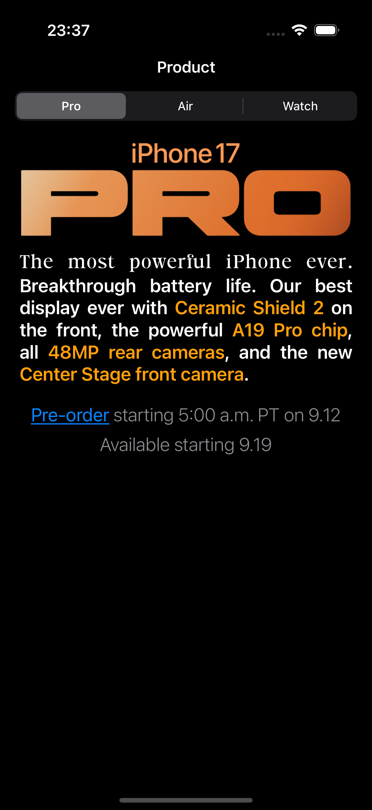
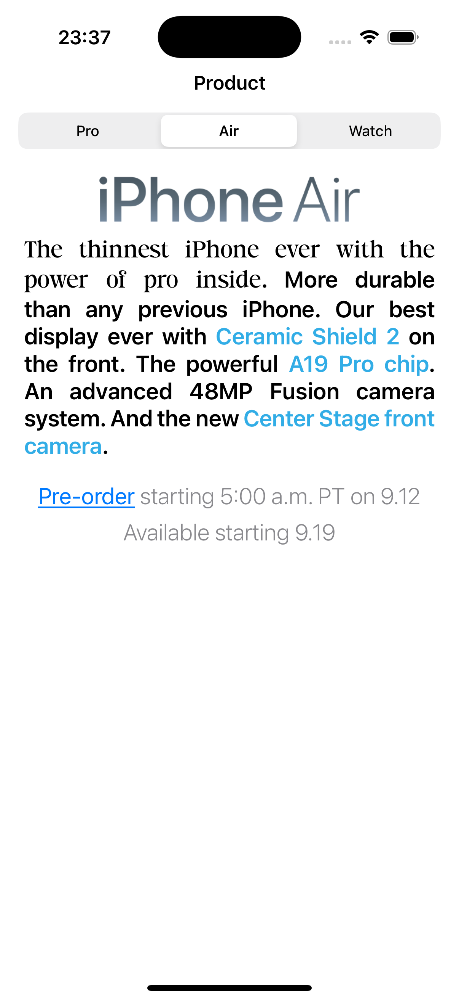

# Атрибутивыне строки

## Описание проекта
Учебное приложение для демонстрации работы с NSAttributedString, интерактивного изменения стилей и отображения контента в UITextView.

## Задача
Реализовать экран с UITextView и набором атрибутов: разноцветный текст, разные шрифты, подчеркнутый абзац, ссылка, изображение, переключаемые стили и кнопки для обновления и сброса оформления.

## Решение
Текст собирается через NSAttributedString с нужными атрибутами, а кнопки и элементы управления обновляют содержимое и позволяют пользователю менять параметры текста.

## Скриншоты

